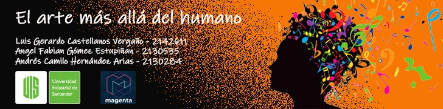

ESPAÑOL:
# El Arte mas allá del Humano.

Bienvenido a nuestro proyecto.

Este proyecto fue propesto para la asignatura Inteligencia Artificial en mi carrera de Ingeniería
de Sistemas. En pocas palabras, consta de una red neuronal recurrente (RNN), para que, mediante patrones
de audio se puedan generan nuevas canciones.

La red es una red pre-entrenada y desarrollada por Google, el nombre de la libreria es **Magenta**, el notebook que
encontraras aquí muestra la implementación de la RNN y el uso de algunos ejemplos.

Video explicativo: https://youtu.be/nnps93GQXYs

Para la ejecución del notebook debes ejecutarlo con la herramienta de Google Colaboratory, 
junto a este notebook se encuentran las canciones en formato midi que tomamos de ejemplo para la ejecución de la red, 
debes ponerla directamente en la carpeta My_drive de Google drive.

ENGLISH:
# Art beyond the Human.

Welcome to our project.

This project was intended for the Artificial Intelligence subject in my Engineering career. 
In short, it consists of a recurrent neural network (RNN), so that, through patterns
audio can generate new songs.

The network is a pre-trained network developed by Google, the name of the library is ** Magenta **, the notebook that
You will find here shows the implementation of the RNN and the use of some examples.

Explanatory video (in spanish): https://youtu.be/nnps93GQXYs

To run the notebook you must run it with the Google Colaboratory tool,
next to this notebook are the songs in midi format that we take as an example for the execution of the network,
you must put it directly in the My_drive folder of Google drive.
